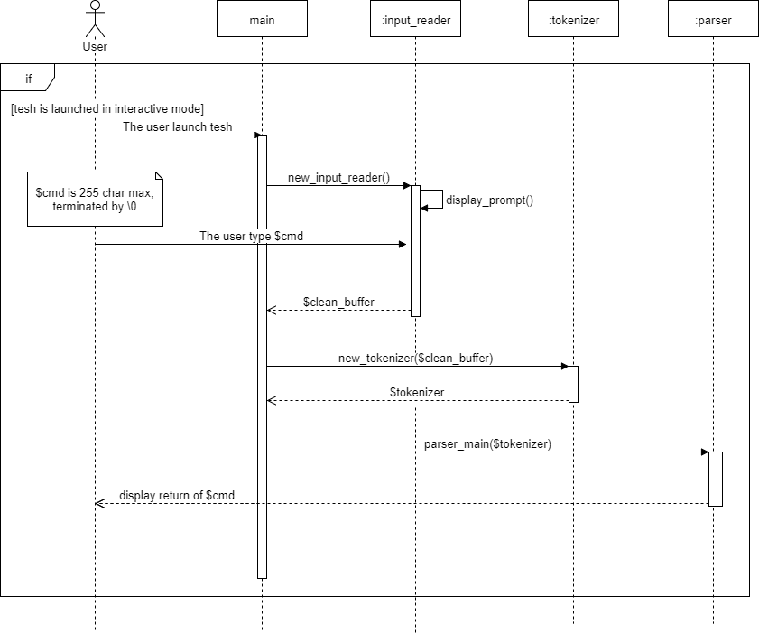

# Input reader doc

## Usage

Used by main when input is user typed from stdin. So the file execution must
be handle differently.

User will type a line of command. It will most likely be syntactically correct,
but it may not be and the user must be properly adverted if so.

A line of command will be computed and executed whenever the user type `enter`.

Buffer size for input command is set to 255

## Sequence diagram

<!---->

